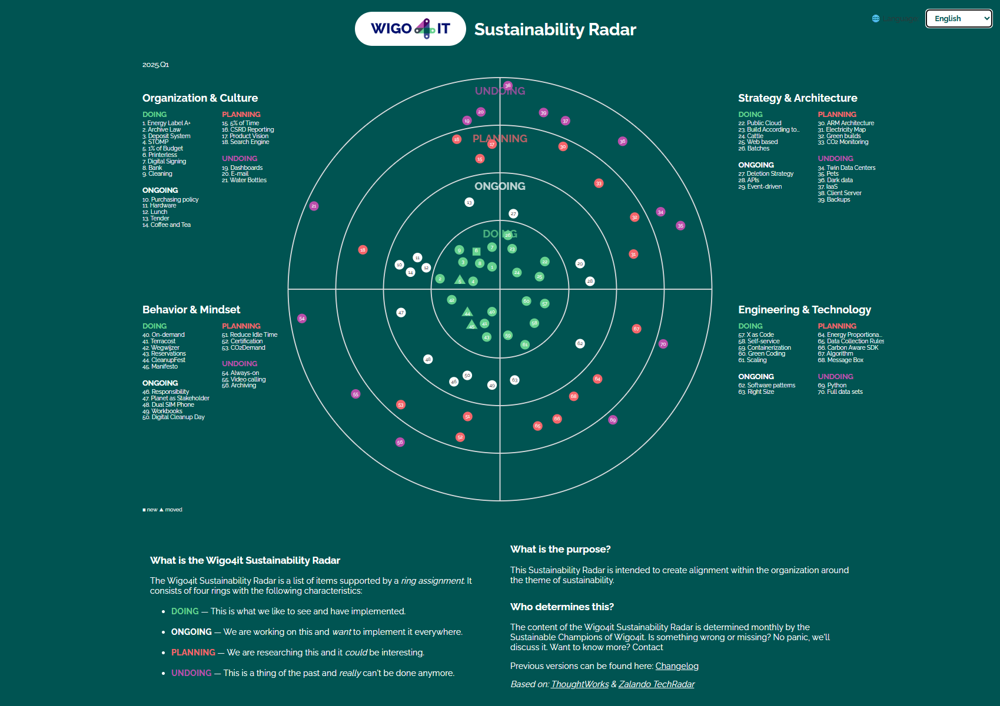

#### (Selecteer je taal hieronder / Choose your language below)

---

# Sustainability Radar at Wigo4it
Welcome to Wigo4it’s [Sustainability Radar](https://duurzaamheidsradar.wigo4it.nl?lang=en)! This radar is inspired by the ThoughtWorks & Zalando Radar and aims to provide insight into our current organizational position on sustainability while also raising awareness.

## Objectives
- *Insight into current position*: The radar offers a visual overview of our progress and performance across various sustainability efforts.
- *Awareness*: By sharing our sustainability initiatives transparently, we aim to increase awareness and engagement both internally and externally.

## Visual representation 
This intuitive and interactive radar highlights our strengths and areas for improvement. The radar serves as a tool for continuous improvement through periodic updates and the involvement of employees and management.

## How to use
The code for this radar is open-source and available on GitHub. You can download, modify, and use the code to evaluate and improve your own sustainability initiatives. We invite you to contribute to this project by sharing suggestions, improvements, and new ideas.

Together we can work towards a more sustainable future. Thank you for your interest and contribution to Wigo4it’s Sustainability Radar!

# Sustainability Radar Licentie

Sustainability Rights (🌱) 2024 WIGO4IT

You are free to use, copy, adapt, distribute, and share this software with anyone you know, as long as the only profit is a more sustainable world. Our mission is simple: inspire people to live more sustainably.

The software is provided “as is", without any guarantees. If your energy consumption or blood pressure rises while using our software, please have a cup of fair trade coffee or tea. Use it at your own risk—and preferably with a smile!

Enjoy the Sustainability Radar and let’s make the world a little greener together!

*This radar is based on the TechRadar by ThoughtWorks [ThoughtWorks](https://www.thoughtworks.com/radar) and [Zalando](https://github.com/zalando/tech-radar). Thanks to them for their inspiration and amazing work!*