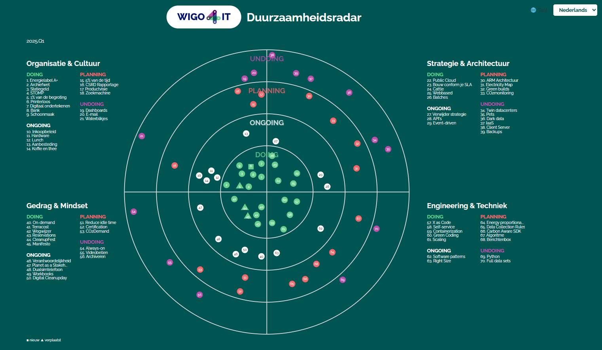

# Duurzaamheidsradar bij Wigo4it
Welkom bij de [duurzaamheidsradar](https://duurzaamheidsradar.wigo4it.nl) van Wigo4it! Deze radar is geïnspireerd door de Thoughtworks & Zalando Radar en heeft als doel om onze huidige positie als organisatie op het gebied van duurzaamheid inzichtelijk te maken en tegelijkertijd bewustwording te creëren.

## Doelstellingen:
- *Inzicht in huidige positie*: De radar biedt een visueel overzicht van onze voortgang en prestaties op verschillende duurzaamheidinspanningen.
- *Bewustwording*: Door onze duurzaamheidsinspanningen transparant te delen, willen we zowel intern als extern bewustzijn en betrokkenheid vergroten.

## Visuele weergave 
Deze intuïtieve en interactieve radar toont onze sterke punten en aandachtspunten. De radar fungeert als een hulpmiddel voor continue verbetering door periodieke updates en betrokkenheid van medewerkers en management.

## Hoe te gebruiken:
De code voor deze radar is open-source en beschikbaar op GitHub. U kunt de code downloaden, aanpassen en gebruiken om uw eigen duurzaamheidsinitiatieven te evalueren en te verbeteren. We nodigen u uit om bij te dragen aan dit project door suggesties, verbeteringen en nieuwe ideeën te delen.

Samen kunnen we werken aan een duurzamere toekomst. Bedankt voor uw interesse en bijdrage aan de Duurzaamheidsradar van Wigo4it!

# Duurzaamheidsradar Licentie

Duurzaamheidsrecht (🌱) 2024 WIGO4IT

Je mag deze software gebruiken, kopiëren, aanpassen, verspreiden en delen met iedereen die je kent, zolang de enige winst een duurzamere wereld is. Onze missie is simpel: inspireer mensen om duurzamer te leven. 

De software wordt geleverd “zoals hij is”, zonder enige garanties. Als je energieverbruik of bloeddruk stijgt door het gebruik van onze software, neem dan een kopje fair trade koffie of thee. Gebruik het op eigen risico en het liefst met een glimlach! 

Geniet van de duurzaamheidsradar en laten we samen de wereld een beetje groener maken!

# Wigo4it Duurzaamheidsradar / Sustainability Radar

A sustainability radar based on the ThoughtWorks Technology Radar, now available in both Dutch and English.

## Features

- **Multi-language Support**: Available in Dutch (Nederlands) and English
- **Dynamic Language Switching**: Language selector in the top-right corner
- **Localized Content**: Both radar data and wiki content are available in multiple languages
- **Browser Language Detection**: Automatically detects user's preferred language
- **URL Language Parameters**: Support for `?lang=en` or `?lang=nl` parameters

## Language Structure

### Translations
- `/translations/nl.json` - Dutch translations
- `/translations/en.json` - English translations

### Data Files
- `/versions/versions.json` - Dutch version metadata
- `/versions/2025-Q1.json` - Dutch radar data
- `/versions/en/versions.json` - English version metadata  
- `/versions/en/2025-Q1.json` - English radar data

### Wiki Content
- `/wiki/*.md` - Dutch wiki articles
- `/wiki/en/*.md` - English wiki articles

## Usage

### Viewing in Different Languages
- Add `?lang=en` to the URL for English
- Add `?lang=nl` to the URL for Dutch (default)
- Use the language selector in the top-right corner

### Adding New Content

#### Adding New Translations
1. Add new keys to both `translations/nl.json` and `translations/en.json`
2. Use `data-i18n="key"` attributes in HTML elements
3. Call `i18n.t('key')` in JavaScript

#### Adding New Radar Items
1. Add items to the appropriate language version files in `/versions/` and `/versions/en/`
2. Create corresponding wiki articles in `/wiki/` and `/wiki/en/`

#### Adding New Wiki Articles
1. Create the Dutch version in `/wiki/filename.md`
2. Create the English version in `/wiki/en/filename.md`
3. The system will fallback to Dutch if English version doesn't exist

## Technical Implementation

The internationalization system uses:
- Pure JavaScript (no frameworks required)
- Automatic language detection from browser settings
- URL parameter support for language override
- Fallback mechanisms for missing translations
- Dynamic content loading based on selected language

## Original Project

Based on the [Zalando Tech Radar](https://github.com/zalando/tech-radar) and inspired by [ThoughtWorks Technology Radar](https://www.thoughtworks.com/radar).
