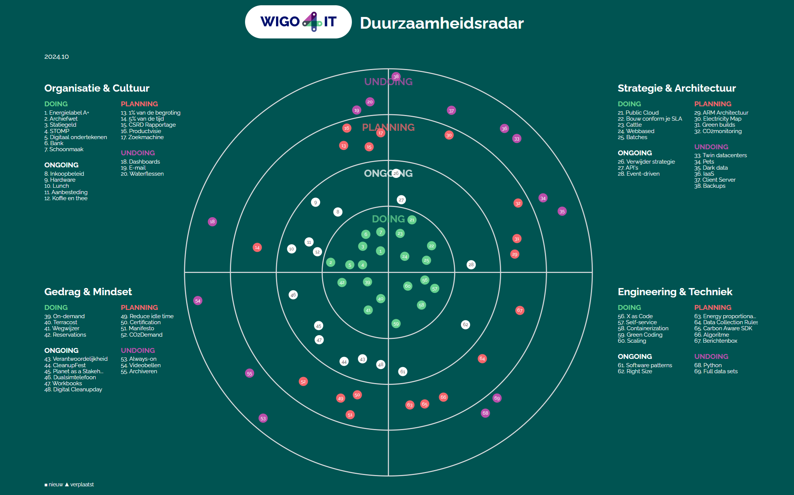

# Duurzaamheidsradar bij Wigo4it
Welkom bij de [duurzaamheidsradar](https://duurzaamheidsradar.wigo4it.nl) van Wigo4it! Deze radar is geïnspireerd door de Thoughtworks & Zalando Radar en heeft als doel om onze huidige positie als organisatie op het gebied van duurzaamheid inzichtelijk te maken en tegelijkertijd bewustwording te creëren.

## Doelstellingen:
- *Inzicht in huidige positie*: De radar biedt een visueel overzicht van onze voortgang en prestaties op verschillende duurzaamheidinspanningen.
- *Bewustwording*: Door onze duurzaamheidsinspanningen transparant te delen, willen we zowel intern als extern bewustzijn en betrokkenheid vergroten.

## Visuele weergave 
Deze intuïtieve en interactieve radar toont onze sterke punten en aandachtspunten. De radar fungeert als een hulpmiddel voor continue verbetering door periodieke updates en betrokkenheid van medewerkers en management.

## Hoe te gebruiken:
De code voor deze radar is open-source en beschikbaar op GitHub. U kunt de code downloaden, aanpassen en gebruiken om uw eigen duurzaamheidsinitiatieven te evalueren en te verbeteren. We nodigen u uit om bij te dragen aan dit project door suggesties, verbeteringen en nieuwe ideeën te delen.

Samen kunnen we werken aan een duurzamere toekomst. Bedankt voor uw interesse en bijdrage aan de Duurzaamheidsradar van Wigo4it!

# Duurzaamheidsradar Licentie

Duurzaamheidsrecht (🌱) 2024 WIGO4IT

Je mag deze software gebruiken, kopiëren, aanpassen, verspreiden en delen met iedereen die je kent, zolang de enige winst een duurzamere wereld is. Onze missie is simpel: inspireer mensen om duurzamer te leven. 

De software wordt geleverd “zoals hij is”, zonder enige garanties. Als je energieverbruik of bloeddruk stijgt door het gebruik van onze software, neem dan een kopje fair trade koffie of thee. Gebruik het op eigen risico en het liefst met een glimlach! 

Geniet van de duurzaamheidsradar en laten we samen de wereld een beetje groener maken!

*Deze radar is gebaseerd op de TechRadar van [ThoughtWorks](https://www.thoughtworks.com/radar) en [Zalando](https://github.com/zalando/tech-radar). Bedankt voor hun inspiratie en geweldige werk!*
